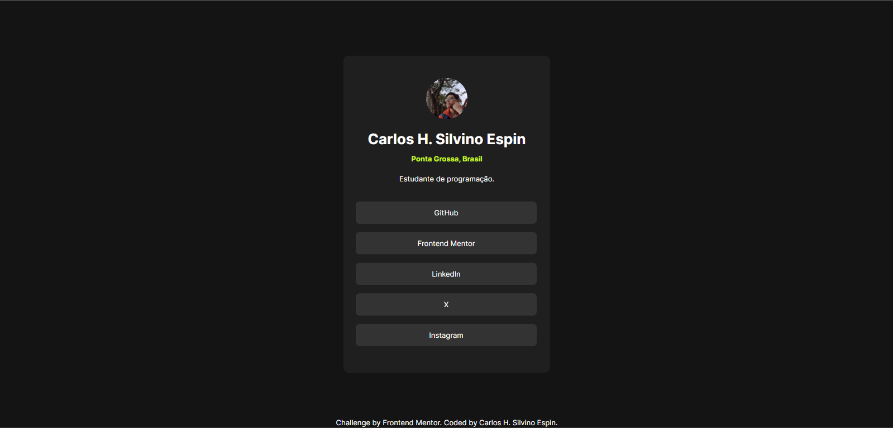

# Social Links Profile - Frontend Mentor Challenge

Este é um projeto de desafio da plataforma [Frontend Mentor](https://www.frontendmentor.io), desenvolvido por **Carlos H. Silvino Espin**. O site consiste em uma página de perfil com links sociais, feita com foco em responsividade e design limpo.



## 🔗 Acesse o projeto

Você pode visualizar a página clicando aqui: [ver demo](#) <!-- substitua pela URL do projeto quando estiver online -->

---

## ✨ Funcionalidades

- Layout responsivo
- Foto de perfil e nome do desenvolvedor
- Links para redes sociais com efeito hover
- Estilização moderna com foco em contraste e acessibilidade

---

## 🛠️ Tecnologias Utilizadas

- HTML5
- CSS3
- Fonte personalizada: [Inter](https://rsms.me/inter/)
- Desafio do [Frontend Mentor](https://www.frontendmentor.io/)

---

## 📁 Como usar localmente

1. Clone o repositório:
```bash
git clone https://github.com/seu-usuario/nome-do-repo.git
```

2. Acesse a pasta do projeto:
```bash
cd nome-do-repo
```

3. Abra o arquivo `index.html` no navegador:
- Você pode clicar duas vezes nele ou usar extensões como Live Server no VSCode.

---

## 🖋️ Autor

Desenvolvido por [Carlos H. Silvino Espin](https://www.linkedin.com/in/carlosespin/)

- GitHub: [Carlos-Espin](https://github.com/Carlos-Espin)
- Frontend Mentor: [@Carlos-Espin](https://www.frontendmentor.io/profile/Carlos-Espin)
- X (Twitter): [@_Nipse_](https://x.com/_Nipse_)
- Instagram: [@_desprogramando](https://www.instagram.com/_desprogramando/)

---

## 📜 Licença

Fonte **Inter** licenciada sob [SIL Open Font License v1.1](https://scripts.sil.org/OFL).  
Mais detalhes no arquivo [`OFL.txt`](./OFL.txt).

---
